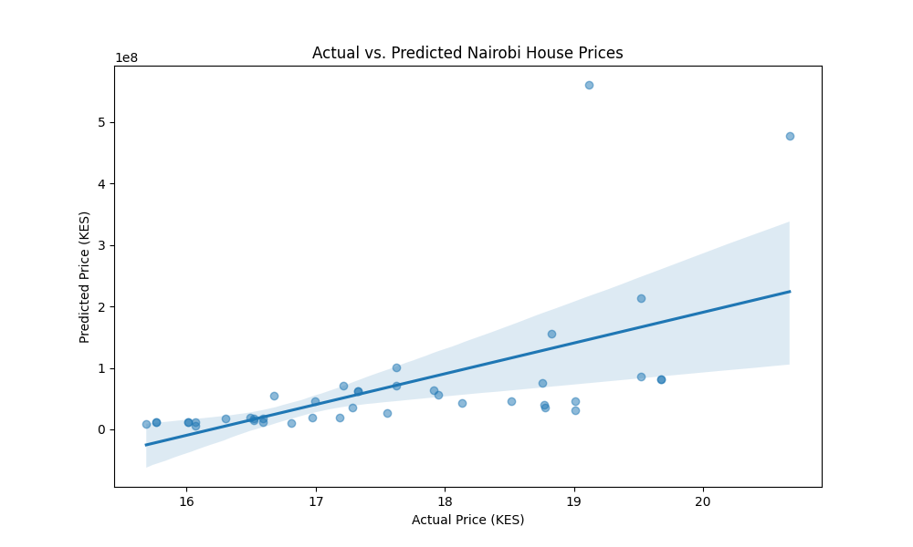

# Nairobi House Price Prediction Model 
 
## Project Overview 
This project uses Multiple Linear Regression to analyze and predict property prices in Nairobi. 
 
## Economic Interpretation 
* **R-Squared (0.71):** Approximately **71% of the variation** in Nairobi house prices is deterministic, explained by the number of **bedrooms, bathrooms, and location**. 
* **Key Determinants:** Location proved to be a major factor, with areas like Rosslyn and Runda commanding significant "Location Premiums." 
* **Marginal Effects:** According to the model coefficients, an additional bedroom adds approximately KES 28M to the valuation, holding all other factors constant. 
 
## Technical Implementation 
* **Cleaning:** Robust regex cleaning to handle currency strings and space-separated thousands. 
* **Preprocessing:** One-Hot Encoding for categorical neighborhood data and median imputation for missing values. 
 
## Visualizing Accuracy 
 
 
## Refined Model: Log-Linear Regression 
* **Log Transformation:** Applied to handle the high variance in Nairobi house prices (from KES 3.5M to 948M). 
* **Interpretation:** The model now predicts percentage changes. A one-bedroom increase correlates with a **56.5%** rise in property value. 
* **R-Squared (0.65):** While lower than the linear model, this provides a more generalized prediction that is less biased by extreme luxury outliers. 
